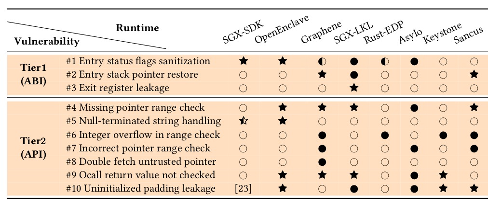

# A tale of two worlds: Assessing the vulnerability of enclave shielding runtimes

This repository contains the source code accompanying our [CCS'19
paper](https://people.cs.kuleuven.be/~jo.vanbulck/ccs19-tale.pdf) which
methodologically analyzes interface sanitization vulnerabilities for 8
different enclave shielding runtimes across the ABI and API tiers.

> Jo Van Bulck, David Oswald, Eduard Marin, Abdulla Aldoseri, Flavio D. Garcia,
> Frank Piessens. A Tale of Two Worlds: Assessing the Vulnerability of Enclave
> Shielding Runtimes. In Proceedings of the 26th ACM Conference on Computer and
> Communications Security (CCS'19).

## Abstract

This paper analyzes the vulnerability space arising in Trusted Execution
Environments (TEEs) when interfacing a trusted enclave application with
untrusted, potentially malicious code. Considerable research and industry
effort has gone into developing TEE runtime libraries with the purpose of
transparently shielding enclave application code from an adversarial
environment. However, our analysis reveals that shielding requirements are
generally not well-understood in real-world TEE runtime implementations. We
expose several sanitization vulnerabilities at the level of the Application
Binary Interface (ABI) and the Application Programming Interface (API) that can
lead to exploitable memory safety and side-channel vulnerabilities in the
compiled enclave. Mitigation of these vulnerabilities is not as simple as
ensuring that pointers are outside enclave memory. In fact, we demonstrate that
state-of-the-art mitigation techniques such as Intel’s edger8r, Microsoft’s
"deep copy marshalling", or even memory-safe languages like Rust fail to fully
eliminate this attack surface. Our analysis reveals 35 enclave interface
sanitization vulnerabilities in 8 major open-source shielding frameworks for
Intel SGX, RISC-V, and Sancus TEEs. We practically exploit these
vulnerabilities in several attack scenarios to leak secret keys from the
enclave or enable remote code reuse. We have responsibly disclosed our
findings, leading to 5 designated CVE records and numerous security patches in
the vulnerable open-source projects, including the Intel SGX-SDK, Microsoft
Open Enclave, Google Asylo, and the Rust compiler.

_Enclave runtime vulnerability assessment and comparison to related work on OSs
and TEEs. Symbols indicate whether a vulnerability was successfully exploited
(star); acknowledged but without proof-of-concept (filled bullet); or not found
to apply (empty bullet).  Half-filled symbols indicate that improper
sanitization only leads to side-channel leakage._

## Source code overview

We provide proof-of-concept exploits for the selected vulnerabilties marked with a star `*` in the above table. The code is organized with a subdirectory for each enclave runtime. As all of the vulnerabilities have been patched, we provide [git submodules](https://git-scm.com/book/en/v2/Git-Tools-Submodules) pointing to the vulnerable runtime versions.

## License

See the corresponding licenses of the various open-source projects we studied.
Our attacker code extensions are released as free software, licensed under
[GPLv3](https://www.gnu.org/licenses/gpl-3.0).
